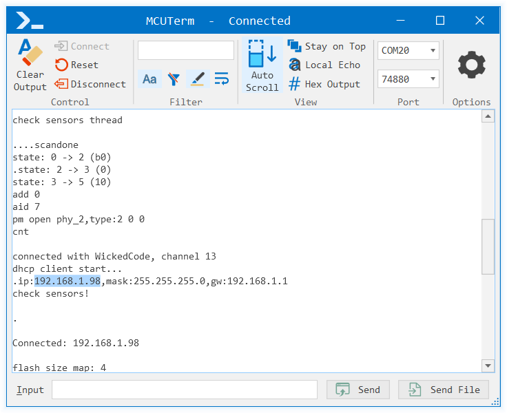
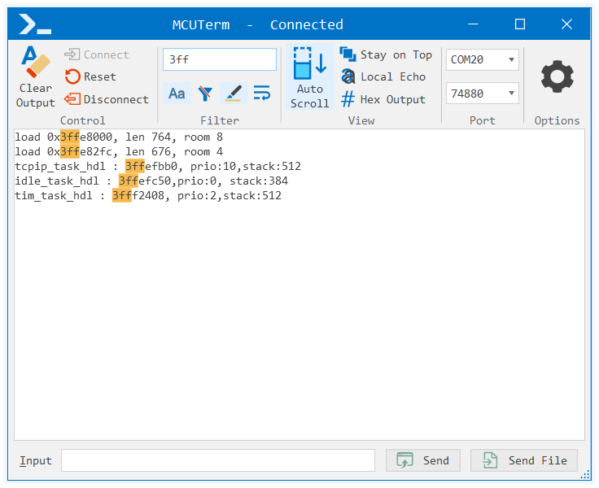
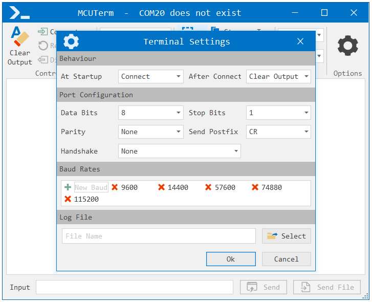

# MCUTerm
MCUTerm is a simple RS232 serial port terminal targeted for use with MCUs (Arduino, esp8266, esp32, etc.). Command line interface allows to disconnect from port in order to upload new firware and than connect again.

Inspired by [Termie2](https://github.com/heiswayi/Termie2). I tried to use it, but High DPI is poorly supported and also it was hard to copy text from the console. So, I decided to write my own terminal, with blackjack and hookers :smirk:

Look and feel inspired by office. Some xaml\cs code parts have been borrowed from [WpfOfficeTheme](https://github.com/TanyaPristupova/WpfOfficeTheme). There was no license so I assume the author is not offended. Actually all code part were mostry rewritten, but anyway I am grateful to the author. Thank you Tanya!

Most of icons are from [Metro Studio](https://www.syncfusion.com/downloads/metrostudio) and [FLATICON](https://www.flaticon.com/)

##### Main features:
* Full High-DPI support
* Command Line Interface (Connect\Disconnect active instance)
* Ability to reset MCU module
* Smart Selection (auto-scroll stop working if something selected)
* Filter\Highlight specified text

## Screenshots







## Downloads
Visit [**release page**](https://github.com/wicked-code/MCUTerm/releases) to download the latest binary package (executable file) of MCUTerm program. Not ready yet. Sorry :flushed:

## Usage details

#### Command Line Options
Any command line option prevents MCUTerm from start. It will command another instance of MCUTerm and then exit.

```
MCUTerm {[Disconnect] [Connect [Run] <PortName> <BaudRate>]}
	Connect - Connect to PortName using BaudRate.
    Run - Start new instance of MCUTerm if it doesn't exist.
    Disconnect - Disconnect from connected port.
```

###### Example of use with ESP8266
```batch
MCUTerm.exe Disconnect
esptool.py.exe -b 921600 --port COM20 write_flash 0x00000 boot_v1.7.bin 0x1000 user1.bin 0x3FC000 esp_init_data_default.bin 0x3FE000 blank.bin -ff 80m
MCUTerm.exe Connect COM20 74880
```

## License

[MIT](LICENSE)